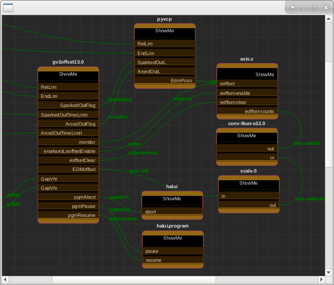

Nodz is a very user friendly python library to create nodes based graphs. It can be connected to anything you want as long as it understands python. Nodz does not hold any data other than its own graphics and attributes types as it is used by the graphics.
Nods provides you with a very simple way to read your graph, it outputs connections as strings ('Node1.attribute1', 'node2.attribute5')

Nodz is partially customizable via a configuration file that let you change colors and the shape of nodes.

EDIT: 28Jan2022 tjtr33
The original slot prints have been restored.
Changes made for use with Linuxcnc Hal components ( like nodes )

Please look at the 3 json files SaveMe01... SaveMe02... SaveMe03...
They show the progression of a graph from rats nest to legible visual explanation
Try running the app 'python3 nodz_demo.py' 
( I use python 3.7 now  28Jan2022 )

The file creation flow:
The LinuxCNC hal files are loaded into LinuxCNC.
Then a command is issued to collect all the nodes and connections.
     halcmd show sig > mysystem.signals
The file mysystem.signals is processed into json for Nodes.
The tool to convert mysystem.signals into mysystem.json is
now included, use 'C' (fro convert) to load a .signal file
and to save the .json file. The process is very fast on configs
tested so far. Please upload your 'filename.signal' file for 
testing. I dont have your hardware, so I cannot create the
.signal files.

I began using 'views' that were focussed viewports of the entire
scene, but now am changing to simply save the node names selected
by user. These nodes are selected and the bounding rect is calculated.
That rect is 'focussed' , whhich creates the 'view'. This way only
a few bytes are stored, rather than the entire database with a 
scaling and viewport center.

Enjoy, tjtr33


***If you find any errors/bugs/flaws or anything bad, feel free to let me know so I can fix it for the next persons that would like to download nodz.***
EDIT: tjtr33 you can contact me thru github

***PLEASE MAKE SURE TO CREATE 1 PULL REQUEST PER ISSUE ! THIS IS EASIER AND CLEANER TO PROCESS***

Nodz in under the [MIT license](LICENSE.txt).

[WATCH DEMO HERE](https://vimeo.com/219933604)
EDIT: tjtr33  a new video is coming

EDIT:
L  to load<br>
S  to save<br>
"+"  to zoom in<br>
"-"  to zoom out<br>
ctrl shift meta left mouse in blank area  to select ALL<br>
double left mouse click in empty space to deselect ALL<br>
control shift left mouse drag   to select am area/group<br>
F to zoom to selected nodes<br>
F to zoom all ( if nothing selected yet, then ALL will be zoomed )<br>
R to get back to original zoom<br>
hover to discover object name and type<br>
click on a bezier net to delete it<br>
left mouse drag from a PLUG to a SOCKET<br>
when a new bezier is dragged near acceptable sockets, they highlight<br>
CtrlShiftMetaLeft Press in empty space selects all
Single Left Press de-selects all
Lassoo an area, then press F to zoom that subset
ControlShiftLeftDoubleClick brings up a text editor

###
## Requirement
The following needs to be installed!
- pip
- pipenv


###
## Installation
- `git clone`
- `cd location`
- `pipenv install`
- enjoy! :)


###
## Configuration file

Nodz comes with a default [configuration file](default_config.json).
This file is sort of 'css' or 'skins' for the app.
The file to L(oad) can be selected from a file dialog.
The file to S(ave) is selected from a file dialog also.

Double clicking on 'ShowMe' raises the multimedia actions.
The node cna have many types of inforamtion displayed,
SVG, manpages, code, urls and more. These are enabled in the
json describing the node, and are specified by the user.

ControlShiftLeftDoubleClick brings up a text editor
and that has the json file loaded. The user can make changes
in the json file, and save it. The press L(oad) and choose that
json file to see the changes you made.

The file format of the json file is pretty simple, study one to
see the order and format. Make simple changes and see the result.
I am experimenting with a library of comps now, but the app is
meant to explain existing configs, I dont have .hal file output
in planning now(28jan2022)

###
## Features

Nodz comes by default with few features, you can toggle the grid visibility and the auto snap mode + some hotkeys. Hotkeys are at the moment based on Autodesk Maya because I developped this library for my personnal use in this specific software but I'm planning on adding that part in the configuration file so everyone can set different hotkeys.

```python
nodz.gridVisToggle = True
nodz.gridSnapToggle = False
```

```
del : delete the selected nodes
f   : zoom focus on selected items, all the items if nothing is selected

```


###
## API

Nodz has a very simple API of 12 methods.
For more information on each method, please read [nodz_main.py](nodz_main.py) as it has all the documentation required.

Initialize
```python
def loadConfig(filePath=defautConfigPath)
def initialize()
```
Nodes
```python
def createNode(name, preset, position, alternate)
def deleteNode(node)
def editNode(node, newName)
```
Attributes
```python
def createAttribute(node, name, index, preset, plug, socket, dataType, plugMaxConnections, socketMaxConnections)
def deleteAttribute(node, index)
def editAttribute( node, index, newName, newIndex)
```
Connections
```python
def createConnection(sourceNode, sourceAttr, targetNode, targetAttr)
```
Graph
```python
def saveGraph(filePath)
def loadGraph(filePath)
def evaluateGraph()
def clearGraph()
```

###
## Signals

Nodz also offers you some signals, most of them can feel redundant considering the design of the library but I'm sure some of you will find a use for it. It's better to have them just in case than not having them.
**They are absolutly not mandatory in order for nodz to work.**

Nodes
```python
signal_NodeCreated(nodeName)
signal_NodeDeleted([nodeNames])
signal_NodeEdited(oldName, newName)
signal_NodeSelected([nodeNames])
signal_NodeMoved(nodeName, nodePos)
signal_NodeDoubleClicked(nodeName)
```
Attributes
```Python
signal_AttrCreated(nodeName, attrIndex)
signal_AttrDeleted(nodeName, attrIndex)
signal_AttrEdited(nodeName, oldIndex, newIndex)
```
Connections
```python
signal_PlugConnected(srcNodeName, plugAttribute, dstNodeName, socketAttribue)
signal_PlugDisconnected(srcNodeName, plugAttribute, dstNodeName, socketAttribue)
signal_SocketConnected(srcNodeName, plugAttribute, dstNodeName, socketAttribue)
signal_SocketDisconnected(srcNodeName, plugAttribute, dstNodeName, socketAttribue)
```
Graph
```python
signal_GraphSaved()
signal_GraphLoaded()
signal_GraphCleared()
```
View
```Python
signal_KeyPressed(key)
signal_Dropped(drop position)
```

